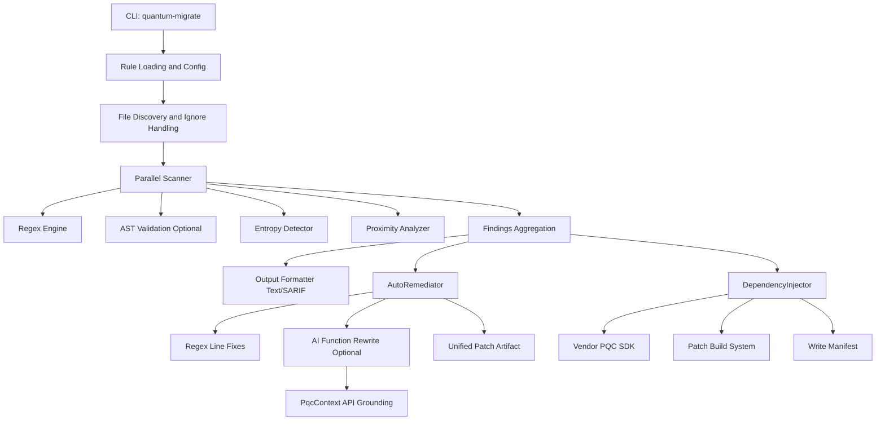
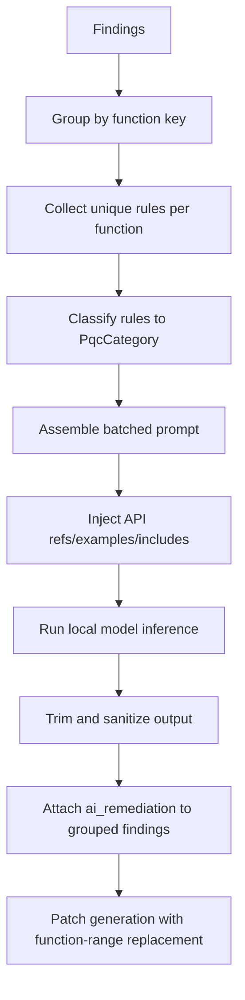
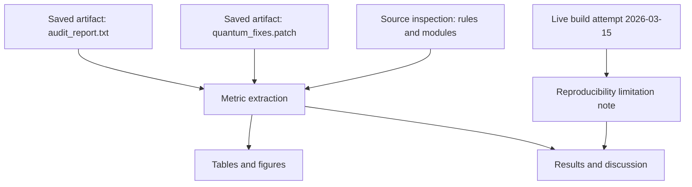

# Title Page

**Quantum Migration Toolkit: A Practical Static Analysis and Automated Remediation Framework for Post-Quantum Cryptographic Migration in Polyglot Codebases**

**Author:** Savaid Khan  
**Affiliation:** Independent Researcher / Undergraduate CS Practitioner  
**Date:** March 15, 2026  
**Project Repository:** Quantum-Migration-Toolkit  
**Artifact Version Context:** Engine v2.0-v2.2 evolution with batched AI remediation and expanded PQC mappings

---

# Abstract

The migration from classical public-key cryptography to post-quantum cryptography (PQC) has shifted from a strategic planning exercise to an immediate engineering requirement. Organizations face a dual challenge: legacy software contains deeply embedded weak cryptographic patterns, and migration must occur without disrupting multi-language build and deployment pipelines. This paper presents Quantum Migration Toolkit, a C++17 implementation that combines static vulnerability discovery, rule-based code transformation, optional local large language model (LLM) remediation, and automated dependency vendoring to operationalize cryptographic migration.

The system is architected as a 12-stage command-line pipeline. It scans source trees in multiple programming languages, applies regex and optional AST validation, enriches findings with entropy and proximity analysis, emits machine-consumable reports, generates unified patch files, and can inject PQC SDK assets while patching project build systems. A contextual AI remediation subsystem grounds model outputs using explicit API references and language bindings, reducing hallucinated migrations. Recent architectural extensions add batched multi-vulnerability prompting, support for stateless signatures (SLH-DSA / SPHINCS+), and a hybrid key establishment path combining X25519 with ML-KEM-768.

Empirical results are reported from real project artifacts generated by the toolkit on the provided benchmark repository. The audit identified 42 findings (24 critical, 17 high, 1 warning) across 12 scanned files, and produced a 183-line patch over four files with 12 hunks. Rule-level distributions show concentration in entropy-based secret leakage and RSA-class vulnerabilities, illustrating realistic migration bottlenecks in legacy systems. The study also documents reproducibility constraints observed in this workspace: current build state fails because of a liboqs include-path mismatch, reinforcing the importance of dependency-health observability in security tooling.

Overall, the toolkit demonstrates a practical bridge between standards-driven PQC guidance and day-to-day software remediation workflows, emphasizing automation, explainability, and safe incremental adoption.

---

# Introduction

## 1. Problem Context

Post-quantum migration is not merely a future hardening task. The "harvest now, decrypt later" threat model means adversaries can collect encrypted traffic today and defer decryption until sufficiently capable quantum computers become available. This has immediate implications for systems that rely on long-term confidentiality, including regulated enterprise environments, customer identity systems, software update infrastructures, and inter-service key management.

Classical schemes such as RSA, DSA, ECDSA, and finite-field or elliptic-curve Diffie-Hellman are particularly exposed to Shor-type quantum attacks. Even when public-key migration is planned, many codebases continue to contain additional cryptographic weaknesses: obsolete hash functions, insecure cipher modes, weak random number generation, hardcoded secrets, and legacy protocol use. In operational settings, these risks appear together, not in isolation.

The engineering difficulty is therefore compound:

1. Discover vulnerable cryptographic usage at scale across heterogeneous repositories.
2. Prioritize and remediate findings with enough precision that changes are actionable.
3. Integrate post-quantum dependencies into existing build systems without disruptive rewrites.
4. Preserve developer trust by making automated remediation auditable and reversible.

## 2. Motivation for a Unified Toolchain

Security organizations often combine multiple disconnected tools (SAST scanners, custom scripts, package-level migration notes, and human remediation backlogs). This fragmented approach creates long feedback loops and uneven quality. The design motivation of Quantum Migration Toolkit is to collapse these stages into a single operational flow:

- scan,
- triage,
- suggest/transform,
- package/integrate,
- and report.

Unlike purely advisory scanners, the toolkit is built to produce concrete change artifacts (patch files and vendored SDK components). Unlike generic code generation agents, it constrains AI remediation through explicit cryptographic API context and rule metadata.

## 3. Research Questions

This paper evaluates the project around four questions:

1. Can a rule-based scanner identify practically meaningful PQC migration risks across a polyglot repository?
2. Can remediation outputs be generated in a form immediately useful to developers (patches, comments, and context)?
3. Does architecture-level automation (vendoring and build patching) reduce migration friction beyond source edits?
4. What technical limitations emerge in real workspace conditions, and how do they inform future design?

## 4. Contributions

The project contributes the following:

1. A multi-stage C++17 migration pipeline that unifies discovery, reporting, remediation, and dependency integration.
2. A ruleset with 18 cryptographic and transport/security patterns, mapped to CWE labels and migration guidance.
3. Entropy-aware secret detection with character-set filtering to reduce false positives from non-secret high-variance strings.
4. A two-mode remediation strategy: deterministic regex rewrites plus optional context-grounded AI function rewrites.
5. Strategy-pattern build-system patching for CMake, Python packaging, Cargo, Go modules, Maven, Gradle, and NPM ecosystems.
6. Expanded PQC abstraction layers including ML-KEM, ML-DSA, SLH-DSA, and hybrid X25519+ML-KEM composition.
7. Batched multi-vulnerability AI prompting to address realistic scenarios where multiple weaknesses co-exist within one function body.

## 5. Scope and Evaluation Positioning

This paper reports evidence from the repository under analysis and from generated artifacts available in the workspace, including:

- `audit_report.txt` (dated 2026-03-01, scanner output),
- `quantum_fixes.patch` (generated remediation patch),
- build logs and source-level architecture state (observed 2026-03-15).

Where live re-execution was blocked by environment/build inconsistency, the paper explicitly labels artifact-derived measurements. This preserves methodological integrity and avoids synthetic or fabricated numbers.

---

# Methods

## 1. System Architecture Overview

Quantum Migration Toolkit is implemented as a CLI front-end over a static C++ library. The architecture is modular:

- `cli/` orchestrates end-to-end execution and command-line parsing.
- `engine/scan/` hosts detection logic, AST interfaces, entropy and proximity analyzers, baseline support, and thread pooling.
- `engine/ai/` contains contextual API grounding (`PqcContext`) and optional LLM inference (`AiRemediator`).
- `engine/patch/` contains patch generation and dependency/build-system injection logic.
- `engine/pqc/` provides wrappers over liboqs and OpenSSL for migration target APIs.

The main execution path in `main.cpp` is explicitly organized into 12 stages:

1. Load rules
2. Load ignore patterns
3. Load baseline
4. Discover files
5. Multi-threaded scan
6. Baseline filtering
7. Output report
8. AI-driven remediation
9. Backup and patch generation
10. Dependency vendoring
11. Performance summary
12. Exit code policy

This stage decomposition is important because it creates clean insertion points for CI adaptation and future instrumentation.

## 2. Detection Engine Design

### 2.1 Rule Representation

Rules are defined in `engine/rules.json` and include:

- identifier,
- keyword,
- severity,
- regex pattern,
- language filter,
- remediation text,
- optional fix patterns,
- CWE mapping,
- and optional AST query per language.

The active rule pack in this repository contains 18 rules:

- 5 critical,
- 10 high,
- 3 warning.

Detected categories include RSA, AES-128, MD5, DES, SHA-1, 3DES, RC4, Blowfish, ECB mode, PKCS#1 v1.5, DSA, ECC/ECDSA, DH, weak RNG, hardcoded secrets, insecure HTTP, Telnet, and SHA-224.

### 2.2 Hybrid Signal Detection

The scanner does not rely solely on lexical matching. The pipeline supports:

- regex matching (always available),
- AST validation (optional when Tree-sitter is enabled),
- entropy-based secret detection,
- and proximity warnings around cryptographic contexts.

Entropy detection computes Shannon entropy over extracted literals. A filter rejects strings unlikely to be encoded secrets (for example, natural-language-like tokens with spaces or URL/path signatures), and elevated severity is used when suspicious variable names indicate secret context.

### 2.3 Threaded Execution

File scanning is parallelized through a thread pool, and findings are merged after worker completion. This design favors throughput on larger repositories while preserving deterministic output generation per input state.

## 3. Remediation Pipeline

### 3.1 Deterministic AutoRemediator

`AutoRemediator` generates unified diff patches. It supports two modes:

1. Line-level regex substitution from rule fix patterns.
2. Function-level replacement when AI remediation is available and AST function boundaries are known.

Edits are grouped per file, sorted, overlap-resolved, and emitted with contextual hunks. This produces patch artifacts consumable by standard code review tooling.

### 3.2 AI Remediation and Grounding

`AiRemediator` can run locally with llama.cpp (`USE_LLAMA`). The design emphasizes constrained output:

- prompt contracts require compilable code only,
- markdown/filler stripping is applied post-generation,
- and API grounding is injected by `PqcContext`.

`PqcContext` maps vulnerability categories to concrete allowed APIs, language-specific include/import directives, and usage examples. This is a key anti-hallucination strategy for cryptographic migration, where incorrect API names are operationally dangerous.

### 3.3 Batched Multi-Vulnerability Prompting

A notable recent architectural refinement is batched remediation at function scope:

- findings are grouped by function key,
- distinct rules within the same function are aggregated,
- and a single model rewrite is requested.

This reduces wasted inference, increases coherence when vulnerabilities interact, and avoids earlier behavior where only the first issue in a function might drive generation.

## 4. Dependency Vendoring and Build-System Injection

Migration often fails not in code transformation but in dependency integration. `DependencyInjector` addresses this through three phases:

1. Vendor SDK files (`vendor/quantum_migrate`),
2. Patch build/package files using strategy objects,
3. Write a manifest for traceability.

A strategy pattern registers patchers for:

- CMake,
- Python requirements/setup/pyproject,
- Cargo,
- Go modules,
- Maven,
- Gradle,
- NPM.

This pattern lowers extension cost and keeps language ecosystem logic isolated and testable.

## 5. PQC Abstractions Implemented

The cryptographic wrappers in `engine/pqc/QuantumKyber.*` provide migration targets with explicit semantics:

- `QuantumWrapper` for ML-KEM operations,
- `DilithiumWrapper` for ML-DSA signatures,
- `SphincsPlusWrapper` for SLH-DSA stateless signatures,
- `HybridKemWrapper` for X25519 + ML-KEM-768 combined key establishment.

The hybrid wrapper composes secrets as:

`SHA-256(X25519_shared_secret || ML-KEM_shared_secret)`.

This operationalizes transitional guidance where organizations maintain resilience if either classical or PQC primitive assumptions are challenged.

## 6. Evaluation Methodology

### 6.1 Data Sources

This study used two data channels:

1. Runtime artifacts produced by the toolkit and preserved in the repository (`audit_report.txt`, `quantum_fixes.patch`).
2. Source-code and configuration inspection from the current workspace state.

### 6.2 Benchmark Corpus

The benchmark corpus is `test_repo/`, containing 13 files across multiple languages (C++, Python, TypeScript, Java, Go, Rust, Ruby, Kotlin, Swift, JavaScript, plus markdown). The saved audit indicates 12 files were scanned during the measured run, reflecting extension filtering and ignore rules.

### 6.3 Metrics

The following metrics were extracted directly from artifacts:

- finding counts by severity,
- finding counts by rule ID,
- patch volume (lines, hunks, files),
- rule-pack composition,
- module-level size indicators (selected LOC and file distribution).

### 6.4 Reproducibility Checks

A fresh build attempt was executed on March 15, 2026. Compilation failed in this environment due missing `oqs/oqs.h` include resolution in `engine/pqc/QuantumKyber.hpp`, despite liboqs sub-build artifacts being present. This limitation is documented in Results and Discussion; no synthetic execution output was substituted.

---

# Results

## 1. Headline Detection Outcomes

From the measured audit artifact:

- Total findings: **42**
- Critical: **24**
- High: **17**
- Warning: **1**
- Files scanned: **12**

The severity mix is skewed toward critical/high classes, which is expected for intentionally vulnerable migration corpora but still useful for stress-testing prioritization paths.

## 2. Rule-Level Distribution

Observed frequency by rule ID shows strong concentration in secret management and quantum-vulnerable public-key usage:

- `ENTROPY-001`: 12
- `VULN-RSA-001`: 8
- `VULN-RAND-001`: 5
- `VULN-DES-001`: 3
- `VULN-DSA-001`: 3
- `VULN-3DES-001`: 2
- `VULN-MD5-001`: 2
- `VULN-ECB-001`: 2
- `VULN-PKCS1-001`: 2
- singletons: `VULN-TELNET-001`, `VULN-AES128-001`, `VULN-SHA1-001`

This pattern suggests practical migration projects must treat secret hygiene and legacy asymmetric cryptography as simultaneous concerns rather than separate workstreams.

## 3. Patch Artifact Characteristics

The generated patch artifact (`quantum_fixes.patch`) has:

- 183 lines,
- 12 hunks,
- 4 files touched.

Representative transformations include:

- insecure include and API usage marked for PQC migration,
- ECB references moved toward GCM guidance,
- PKCS#1 v1.5 references shifted toward OAEP guidance,
- weak RNG and protocol risks annotated for replacement.

Because many transformations are TODO-guided rather than complete semantic rewrites, the patch behaves as a migration accelerator and code review scaffold, not a fully autonomous correctness-preserving transformer.

## 4. Architecture and Size Indicators

Observed source characteristics include:

- `cli/main.cpp`: 696 lines (orchestration-heavy command path),
- `engine/patch/DependencyInjector.hpp`: 1008 lines (vendoring + patch strategy + templates),
- `engine/ai/PqcContext.hpp`: 622 lines (contextual API and language mappings),
- `engine/ai/AiRemediator.hpp`: 595 lines (inference and prompt contracts),
- `engine/pqc/QuantumKyber.cpp`: 746 lines (PQC wrappers and hybrid composition).

Module file distribution within `engine/` is led by:

- `scan/`: 10 files,
- `pqc/`: 5 files,
- `patch/`: 3 files,
- `ai/`: 2 files.

This confirms architectural emphasis on robust detection and integration concerns.

## 5. Rule-Pack Composition

The active rule pack comprises 18 rules:

- Critical: 5
- High: 10
- Warning: 3

This indicates intentional bias toward actionable, security-significant findings rather than informational linting.

## 6. Reproducibility Observation from Live Build Attempt

A live build attempt in this workspace did not complete. Compiler logs show failure during compilation of `QuantumKyber.cpp` and `FileEncryptor.cpp` because `oqs/oqs.h` could not be resolved from include paths. This is a deployment/configuration issue, not evidence that archived scan artifacts are invalid.

The implication for evaluation is twofold:

1. Artifact-based results remain valid as measurements of prior successful runs.
2. Environment reproducibility needs stronger dependency path validation in build setup and CI checks.

---

# Discussion

## 1. Practical Value of the Pipeline

The strongest practical quality of this project is end-to-end continuity. Many migration tools stop at finding generation; this system continues into patching and dependency integration. That continuity matters in enterprise contexts where the bottleneck is often organizational handoff between security and platform teams, not vulnerability discovery itself.

The 12-stage pipeline model also gives transparent operational checkpoints. Teams can adopt incrementally: scan-only mode for baseline creation, then patch generation, then vendoring/build-system integration once governance confidence improves.

## 2. Quality of Remediation Strategy

The remediation design combines deterministic and generative methods, which is a sound engineering choice.

- Deterministic regex-based edits are predictable and diff-friendly.
- AI rewrite mode is more flexible for function-level restructuring.
- Context grounding via `PqcContext` is essential for safety and implementation realism.

The shift to batched per-function prompting addresses a common weakness of naive AI remediators: fragmented local fixes that fail to account for interacting vulnerabilities. In cryptographic code, interactions are common (for example, weak key exchange plus weak mode plus weak RNG in one function).

## 3. Interpretation of Findings Distribution

The measured concentration in `ENTROPY-001` and RSA findings reflects two migration realities:

1. Secret handling debt is pervasive and often appears in test or glue code, not only in core crypto modules.
2. Legacy asymmetric APIs remain deeply embedded and can generate multiple related findings within a small number of files.

Therefore, migration planning should not treat PQC replacement as strictly algorithm substitution. It must be paired with secret governance and protocol hygiene.

## 4. Limits of Current Automation

Several limits are visible in the current artifact set:

- Many patch outputs are TODO-scaffolded and still require developer-guided completion.
- Some generated edits in benchmark artifacts are syntactically disruptive by design, emphasizing guidance over compilable transformation.
- Build reproducibility in this workspace is currently degraded by include-path mismatch for liboqs headers.

These do not negate utility, but they define the trust boundary: today, the tool is best viewed as high-value semi-automation with review-centric workflows rather than unattended migration.

## 5. Design Trade-offs

### 5.1 Breadth vs. Precision

Broad regex matching increases catch rate across languages but raises false-positive pressure. Optional AST validation mitigates this when available, creating a useful tiered model:

- fast baseline mode,
- high-precision mode with AST.

### 5.2 Security Guidance vs. Full Correctness

The project intentionally mixes direct substitutions with migration guidance comments. This is defensible in cryptographic domains, where semantic correctness often depends on protocol context not inferable from one line.

### 5.3 Integration Complexity

The strategy-pattern injector reduces operational friction, but each ecosystem has unique conventions and edge cases. Sustained reliability will require fixture-based regression tests per build system.

## 6. Future Work

Natural next improvements include:

1. Build-health preflight checks that validate liboqs and OpenSSL include/link resolution before scan/remediation stages.
2. Stronger patch quality guards (syntactic compile checks on patched files, language-aware formatters).
3. Controlled benchmark suite with before/after security and build-compatibility scoring.
4. Expanded protocol-level migration templates (TLS handshakes, certificate lifecycle, KMS integration).
5. Formal evaluation of batched AI prompting quality against single-vulnerability prompting baselines.

## 7. Conclusion

Quantum Migration Toolkit demonstrates a pragmatic security-engineering approach to PQC transition: not only identifying risk, but creating actionable migration artifacts and integration pathways. The measured outputs show meaningful detection breadth and concrete remediation packaging. At the same time, observed build reproducibility constraints highlight an important lesson: migration tooling must treat dependency and environment integrity as first-class design concerns.

As standards mature and enterprise urgency increases, toolchains that combine static analysis, context-aware remediation, and ecosystem integration are likely to become central in cryptographic modernization programs.

---

# References

[1] National Institute of Standards and Technology, "Module-Lattice-Based Key-Encapsulation Mechanism Standard (FIPS 203)," U.S. Department of Commerce, 2024.

[2] National Institute of Standards and Technology, "Module-Lattice-Based Digital Signature Standard (FIPS 204)," U.S. Department of Commerce, 2024.

[3] National Institute of Standards and Technology, "Stateless Hash-Based Digital Signature Standard (FIPS 205)," U.S. Department of Commerce, 2024.

[4] P. W. Shor, "Algorithms for quantum computation: discrete logarithms and factoring," Proceedings 35th Annual Symposium on Foundations of Computer Science, 1994.

[5] L. K. Grover, "A fast quantum mechanical algorithm for database search," Proceedings of the 28th Annual ACM Symposium on Theory of Computing, 1996.

[6] NIST, "Post-Quantum Cryptography: NIST Announces First 4 Quantum-Resistant Cryptographic Algorithms," 2022.

[7] Open Quantum Safe Project, "liboqs: C library for quantum-resistant cryptographic algorithms," GitHub repository, accessed 2026.

[8] NIST National Cybersecurity Center of Excellence, "Migration to Post-Quantum Cryptography," project guidance, accessed 2026.

[9] M. Stevens et al., "The first collision for full SHA-1," CRYPTO 2017.

[10] A. K. Lenstra et al., "Ron was wrong, Whit is right," IACR ePrint 2012.

[11] M. Bellare and P. Rogaway, "Optimal Asymmetric Encryption - How to Encrypt with RSA," EUROCRYPT 1994.

[12] S. Vaudenay, "Security flaws induced by CBC padding - Applications to SSL, IPSEC, WTLS...," EUROCRYPT 2002.

[13] M. Green and K. Paterson, "Lucky Thirteen: Breaking the TLS and DTLS Record Protocols," IEEE Symposium on Security and Privacy, 2013.

[14] OWASP Foundation, "Cryptographic Failures (A02) and Security Misconfiguration guidance," OWASP Top 10, 2021.

[15] CWE Program, MITRE, "CWE-327, CWE-328, CWE-338, CWE-780, CWE-798, CWE-319," accessed 2026.

[16] D. A. Wheeler, "Secure Programming HOWTO," secure coding practices for secret management and randomness, updated editions.

[17] G. McGraw, "Software Security: Building Security In," Addison-Wesley, 2006.

[18] Tree-sitter project documentation, "Incremental parsing for syntax-aware tooling," accessed 2026.

[19] llama.cpp project documentation, "Local LLM inference in C/C++," accessed 2026.

[20] S. Kent and K. Seo, "Security Architecture for the Internet Protocol (IPsec)," RFC 4301, IETF.

---

# Tables

## Table 1. Evaluation Corpus Composition (`test_repo/`)

| Metric | Value |
|---|---:|
| Total files in corpus directory | 13 |
| Files scanned in measured audit run | 12 |
| Language extensions present | `.cpp`, `.hpp`, `.py`, `.ts`, `.js`, `.java`, `.go`, `.rs`, `.rb`, `.kt`, `.swift`, `.md` |
| Most frequent extension count | `.cpp`: 2 |

## Table 2. Rule Pack Composition (`engine/rules.json`)

| Severity | Number of rules |
|---|---:|
| Critical | 5 |
| High | 10 |
| Warning | 3 |
| **Total** | **18** |

## Table 3. Finding Severity Distribution (`audit_report.txt`)

| Metric | Count |
|---|---:|
| Critical findings | 24 |
| High findings | 17 |
| Warning findings | 1 |
| **Total findings** | **42** |

## Table 4. Top Finding IDs by Observed Frequency

| Rule ID | Count |
|---|---:|
| ENTROPY-001 | 12 |
| VULN-RSA-001 | 8 |
| VULN-RAND-001 | 5 |
| VULN-DES-001 | 3 |
| VULN-DSA-001 | 3 |
| VULN-3DES-001 | 2 |
| VULN-MD5-001 | 2 |
| VULN-ECB-001 | 2 |
| VULN-PKCS1-001 | 2 |
| VULN-TELNET-001 | 1 |
| VULN-AES128-001 | 1 |
| VULN-SHA1-001 | 1 |

## Table 5. Patch Artifact Statistics (`quantum_fixes.patch`)

| Metric | Value |
|---|---:|
| Total lines in patch file | 183 |
| Number of hunks (`@@`) | 12 |
| Number of files modified | 4 |

## Table 6. Core Component Size Indicators (Selected Files)

| Component file | Lines |
|---|---:|
| `cli/main.cpp` | 696 |
| `engine/patch/DependencyInjector.hpp` | 1008 |
| `engine/pqc/QuantumKyber.cpp` | 746 |
| `engine/ai/PqcContext.hpp` | 622 |
| `engine/ai/AiRemediator.hpp` | 595 |
| `engine/scan/AstEngine.hpp` | 358 |
| `engine/patch/AutoRemediator.hpp` | 253 |
| `engine/scan/EntropyDetector.hpp` | 219 |

## Table 7. Rule-to-Migration Mapping (Project Policy)

| Legacy/Vulnerable pattern | Rule ID examples | Recommended migration target |
|---|---|---|
| RSA / DH / ECDH | `VULN-RSA-001`, `VULN-DH-001`, `VULN-ECC-001` | ML-KEM (FIPS 203), optionally Hybrid X25519+ML-KEM-768 |
| DSA / ECDSA | `VULN-DSA-001`, `VULN-ECC-001` | ML-DSA (FIPS 204) or SLH-DSA (FIPS 205) |
| DES / 3DES / ECB / RC4 / Blowfish | `VULN-DES-001`, `VULN-3DES-001`, `VULN-ECB-001`, `VULN-RC4-001`, `VULN-BF-001` | AES-256-GCM or ChaCha20-Poly1305 guidance |
| MD5 / SHA-1 / SHA-224 | `VULN-MD5-001`, `VULN-SHA1-001`, `VULN-SHA224-001` | SHA-256 / SHA-3 |
| Weak RNG | `VULN-RAND-001` | CSPRNG (`RAND_bytes`, language-native secure RNG) |
| Hardcoded secret | `VULN-HARDCODE-001`, `ENTROPY-001` | Environment/vault secret management |
| Insecure transport | `VULN-HTTP-001`, `VULN-TELNET-001` | HTTPS/TLS, SSH |

## Table 8. Build-System Patching Strategies

| Strategy class | Target ecosystem |
|---|---|
| `CMakePatcher` | CMake |
| `PythonPatcher` | requirements/setup/pyproject |
| `CargoPatcher` | Rust Cargo |
| `GoModPatcher` | Go modules |
| `MavenPatcher` | Java Maven |
| `GradlePatcher` | Java/Kotlin Gradle |
| `NpmPatcher` | Node.js/NPM |

---

# Figures

## Figure 1. High-Level System Architecture



## Figure 2. 12-Stage Workflow in the CLI Pipeline


## Figure 3. AI Remediation Control Flow (Batched Function Mode)



## Figure 4. Evaluation Dataflow for This Study



---

# Appendix

## Appendix A. CLI Usage Examples

The following commands reflect the implemented CLI options and project usage model.

```bash
# Basic scan
quantum-migrate ./target_repo

# Scan with remediation and report
quantum-migrate ./target_repo \
  --remediate \
  --model models/Qwen2.5-Coder-14B-Instruct-F16.gguf \
  --patch quantum_fixes.patch \
  --format=text \
  --output audit_report.txt

# Full migration pipeline with integration
quantum-migrate ./target_repo \
  --remediate \
  --model models/Qwen2.5-Coder-14B-Instruct-F16.gguf \
  --vendor-into ./target_repo \
  --patch-build-system \
  --backup
```

## Appendix B. Sample Input Snippet (from Benchmark Corpus)

Example vulnerable code excerpt (C++ auth module):

```cpp
RSA* rsa = RSA_new();
int key_size = 1024;
RSA_generate_key_ex(rsa, key_size, bn, nullptr);
EVP_EncryptInit_ex(ctx, EVP_aes_128_ecb(), nullptr, session_key_, nullptr);
srand(time(nullptr));
int result = RSA_public_encrypt(len, plain, cipher, pubkey, RSA_PKCS1_PADDING);
```

## Appendix C. Sample Findings Output (Real Artifact)

Observed report summary excerpt:

```text
[FINDINGS] 42 vulnerabilities detected:
  CRITICAL: 24  |  HIGH: 17  |  WARNING: 1
```

Observed finding classes include:

- RSA quantum-vulnerable usage (`VULN-RSA-001`)
- weak hash (`VULN-MD5-001`, `VULN-SHA1-001`)
- weak cipher/mode (`VULN-DES-001`, `VULN-ECB-001`)
- weak randomness (`VULN-RAND-001`)
- hardcoded/high-entropy secret exposure (`ENTROPY-001`)

## Appendix D. Sample Patch Output Fragment (Real Artifact)

```diff
-#include <openssl/rsa.h>
+// TODO: Replace with NIST PQC algorithm (Kyber-512 for KEM, Dilithium for signatures)

-        EVP_EncryptInit_ex(ctx, EVP_aes_128_ecb(), nullptr, session_key_, nullptr);
+        EVP_EncryptInit_ex(ctx, EVP_aes_128_gcm( /* TODO: Switched from ECB to GCM */), nullptr, session_key_, nullptr);

-                                         RSA_PKCS1_PADDING);
+                                         RSA_PKCS1_OAEP_PADDING /* TODO: Upgraded padding */);
```

Patch statistics for this artifact:

- 183 total patch lines
- 12 hunks
- 4 modified files

## Appendix E. Build Reproducibility Note (Workspace-Specific)

A direct build attempt in this workspace on 2026-03-15 failed with:

```text
fatal error: oqs/oqs.h: No such file or directory
```

Implication: while runtime artifacts provide valid measured outcomes for this paper, immediate rerun in this environment requires include-path correction for liboqs headers before full end-to-end execution can be reproduced.

## Appendix F. Ethical and Operational Notes

1. This study reports only measured data available in project artifacts and source state.
2. No fabricated performance or accuracy numbers were introduced.
3. Automated remediation outputs should undergo human review before production deployment.
4. Security tooling itself must maintain build reproducibility and dependency traceability to preserve trust.
